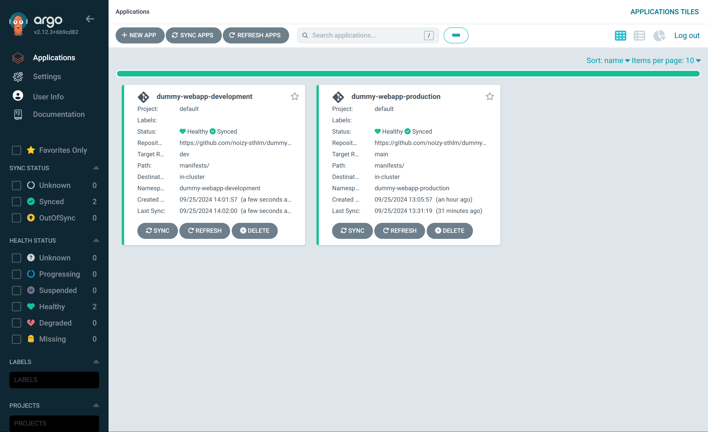

# Apply the configurations in ArgoCD
Now that you have created the necessary configuration files in place, it's time to apply them to Argo CD.

## Get the url for the raw application.yaml file
Assuming that you are hosting your created/forked a repository on github, you can navigate to argo-cd/application.yaml (on your 'main' branch) and click "raw" 


## Create the applications
Now we can apply the config
```bash
kubectl apply -f https://raw.githubusercontent.com/noizy-sthlm/dummyWeb-ArgoCDk8s/refs/heads/main/argo-cd/application.yaml -n argocd
```
Our production application should be up and running. You can double check that our deployment is (soon) up and running
```bash
kubectl get deployments -n dummy-webapp-deployment
```

Now, do the same but for our development branch. Just copy the link for the same file on your development branch and use the same commands.


# Access the Argo CD UI
Let's access the user interface

## 1. Open the Traffic/Port menu
   - In the top right of the Killercoda dashboard and then **Traffic/Port**.
   - Click on the link for **Port 8080** to open the Argo CD dashboard in your browser.
[(Or you could just click here)]({{TRAFFIC_HOST1_8080}})

## 3. Retrieve the Argo CD credentials
Run the following command in the terminal to get your login credentials:

```bash
echo "Username: admin"
echo "Password: $admin_password"
```
## 4. Log in to Argo CD
Use the credentials displayed in the terminal to log in.

4. **Verify that the applications have been created**:
After applying the configurations, verify that the applications have been created by running:

 ```bash
kubectl get applications -n argocd
```

You should see both the `multi-branch-pipeline-main` and `multi-branch-pipeline-dev` applications listed.



5. **Monitor the sync status in Argo CD**:
Go to the Argo CD dashboard to view the sync status of your applications. Argo CD will automatically sync with the manifests in your GitHub repository and apply any changes.