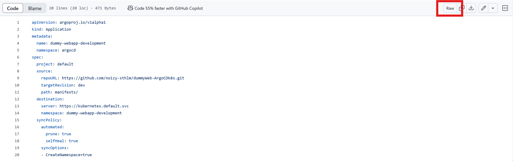

# Apply the configurations in ArgoCD
Now that you have the manifest files in place, it's time to apply them to Argo CD.

## Deploy the production web-app
We'll first deploy the production web-app. Grab the url to the application.yaml file in raw format (in your `main`{{}} branch) and execute the following command in this virtual-machine:

`kubectl apply -f <URL-to-your-application.yaml> -n argocd`{{copy}}

> ### Get the url for the raw application.yaml file
>Assuming that you are hosting your repository on github, you can navigate to argo-cd/application.yaml (on your 'main' branch) and click "raw" and copy the url
>

Our production application should (soon) be up and running. Invoke `kubectl`{{}} to see for yourself:

`kubectl get deployments -n dummy-webapp-production`{{exec}}

Now, do the same but for our development branch. Just copy the link for `application.yaml`{{}} from your development branch on GitHub and use the same commands to deploy.

## How to access the web-app?
To access the production web-app:
`kubectl port-forward svc/dummy-webapp-service -n dummy-webapp-production 8888:8888 --address 0.0.0.0 &`{{exec}}

[(Click here to access the production site)]({{TRAFFIC_HOST1_8888}})

And our development site:
`kubectl port-forward svc/dummy-webapp-service -n dummy-webapp-development 9999:8888 --address 0.0.0.0 &`{{exec}}

[(Click here to access the dev site)]({{TRAFFIC_HOST1_9999}})

See, Argo CD actually deployed our apps 👌