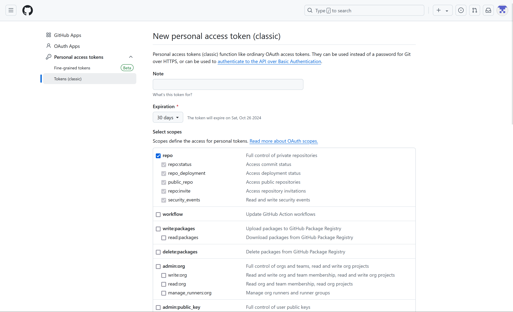
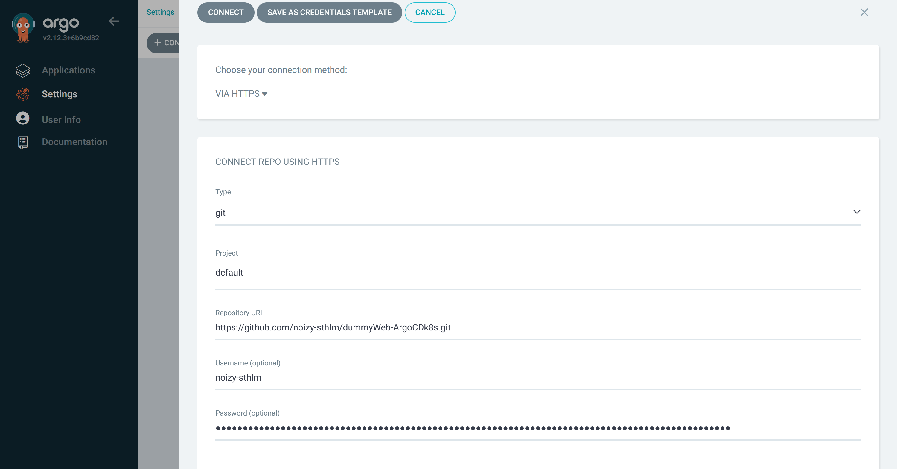
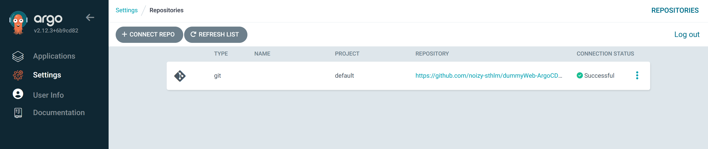

# Access the Argo CD UI
Let's access the user interface

## 1. Retrieve the Argo CD credentials
Run the following command in the terminal to get your Argo CD credentials:

`echo "Username: admin"`{{exec}}

`echo "Password: $admin_password"`{{exec}}

## 2. Open the Traffic/Port menu
   - In the top right of the Killercoda dashboard and then **Traffic/Port**.
   - Click on the link for **Port 8080** to open the Argo CD dashboard in your browser.
[(Or you could just click here 6 times)]({{TRAFFIC_HOST1_8080}})

## 3. Sign in to Argo CD
Use the credentials displayed in the terminal to log in.

You should see both the `dummy-webapp-production`{{}} and `dummy-webapp-development`{{}} applications listed.

Click on either of the apps to see the structure and status of your apps.

# 4. Give Argo-CD write access to your git repository
In the next steps, you will push changes of your deployment manifest and new image builds to your Docker Hub to see how Argo CD reacts. Therefore, you will first have to give Argo CD write access to your repository.

## 4.a Generate a github token
Assuming that you're using GitHub, the simplest option is to generate a *(classic) personal access tokens* with write rights to your repositories.

## 4.b Connect your repo to Argo CD
- In the Argo CD user interface, enter `Settings`{{}} on the left-hand bar and enter `Repositories`{{}}.
- Click on `+ CONNECT REPO`{{}}
- Select `HTTPS`{{}} as connection method and enter your repo URL, username and the github access token as password.
- Set `type`{{}} to `git`{{}} and `project`{{}} to `default`{{}}
- Click `CONNECT`{{}}

You should see that Argo successfully connected to your repository

