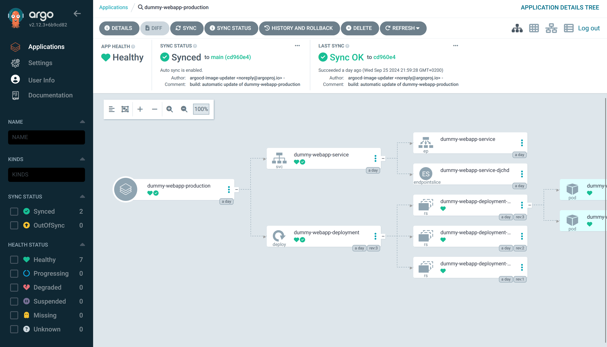

# See the magic of Argo CD
You will now make some changes to your manifests as well as push new image builds and see how Argo CD automatically syncs them to your cluster.

## Edit the number of replicas
In your development branch, increase the desired number of replicas in `manifests/webapp-deployment.yaml`{{}}:

```bash
...
spec:
  replicas: 3
...
```

## Push new image builds to Docker Hub
You should build and push new builds for both the `:dev`{{}} and `:prod`{{}} images. These new builds could print something like `"Production image v2.0"`{{}} or `"Updated development image v2.0"`{{}}.

***Forgot how to do this? The instructions are on step 1***

## Observe the magic of Argo CD
Now go back to Argo CD and see how it automatically recognizes these changes and updates your deployment. You could select one of the applications and see how the tree structure transforms as new replicas are added and the new images are deployed. You can also see when Argo CD last recognized a change:



**Don't try to sync manually, you wan't to see that Argo CD will do it automatically**
***Note that it could take up to 5 minutes for these changes to be recognizes. If you don't like waiting, Google on how to use webhooks with Argo CD***

## Visit the new web sites
Once Argo has finished synchronizing, you can browse to them to see that they are actually deployed of your new image builds.

`kubectl port-forward svc/dummy-webapp-service -n dummy-webapp-production 8881:8888 --address 0.0.0.0 &`{{exec}}

[(Click here to access the production site)]({{TRAFFIC_HOST1_8881}})

And our development site:
`kubectl port-forward svc/dummy-webapp-service -n dummy-webapp-development 9991:8888 --address 0.0.0.0 &`{{exec}}

[(Click here to access the dev site)]({{TRAFFIC_HOST1_9991}})

Click **Finish** when you're done to complete the tutorial.